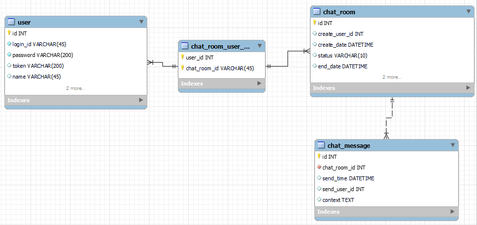

# 🤺 chat-java
###채팅 Java Spring boot 로 구현
해당 프로젝트는 Restful API를 준수하며, TDD 방식으로 개발을 할 예정입니다.

해당 화면과 이어지는 Front 화면

Git : https://github.com/GoDeokHwan/chat-front

***
## 📜스팩

- java11
- Spring boot 2.5.6
- Spring Security
- JPA
- Mysql
- H2
- Junit5

***
## 📜 폴더구조

```
chat-java
   ㄴ api : API 패키지 폴더
       ㄴ src
          ㄴ java 
           ㄴ config   : Spring 설정
           ㄴ domain   : 보안 정책을 받으면서 사용 될 API 패키지
           ㄴ entity   : DB Entity 패키지 
           ㄴ external : 보안 정책 없이 외부에서 들어 올 수 있는 패키지
           ㄴ supoort  : 외부 라이브러리를 이용해서 도움되는 패키지 
           ㄴ util     : 사용중에 공통으로 도움이 되는 패키지
         ㄴ resources
            ㄴ logging : 로그 설정 
            application.yml : 전체적인 Spring 설정 yml            
```
***
## 📜 DB ERD


1. 테이블 설명
- user : 사용자 정보
- chat_room : 채팅
- chat_message : 채팅 메시지
- chat_room_user_mapping : 채팅에 들어오는 사용자

2. 테이블 관리 해당 문서로 관리 합니다.
```
resource
  ㄴ chat_erd.mwb
  ㄴ schema-create.sql
```


***
## 📜 변경 사항
- 21.10.25
1. GlobalException 추가
2. Rest API Connection Config 설정 

- 21.10.24
1. 사용자 추가 케이스 추가 (회원가입을 따로 구현을 하지 않을 예정입니다.)
2. Security 적용 
3. 반환 ApiResult 통일 

- 21.10.23
1. 프로세스 확인 Rest API 추가
2. Controller Test Case 추가 테스트 
3. Mysql DB 연결
4. Mysql ERD 설계 완료 
5. Jpa 정상 동작 확인